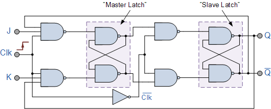
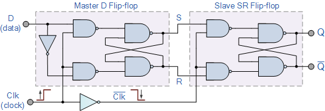
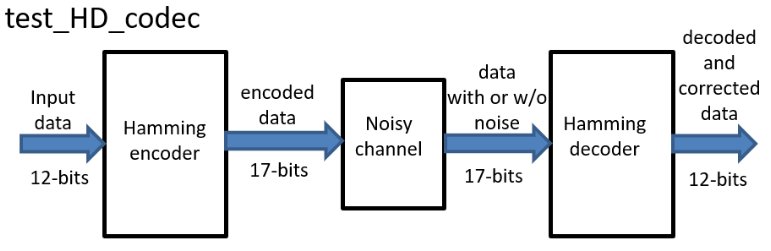

<br><br><br><br>

<br>

<br>
<br>

<h3 style="text-align: center; ">Ψηφιακά Συστήματα H/W σε Χαμηλά Επίπεδα Λογικής ΙΙ</h3>
<h4 style="text-align: center; margin-top: -20px;">Εργασία 2021</h4>


<p style="text-align: center;">Κωνσταντίνος Χατζής</p>

<p style="text-align: center;">ΑΕΜ: 9256</p>

<p style="text-align: center;">kachatzis@ece.auth.gr</p>

<p style="text-align: center;">Ημερομηνία: 8/07/2021</p>

<div style="page-break-after: always; break-after: page;"></div>

<h5>Περιεχόμενα</h5>

[TOC]


​	Το σύνολο των αρχείων που χρησιμοποιήθηκαν για τη συγγραφή της παρούσας αναφοράς, καθώς και ο κώδικας σε Verilog και Matlab μπορεί να βρεθεί στο σύνδεσμο: https://github.com/kostascc/HW2-Project


<div style="page-break-after: always; break-after: page;"></div>
# I. Finite State Machine

## Ι.1. Ανάλυση

​	Στο πρώτο μέρος της εργασίας ασχολούμαστε με την υλοποίηση ενός πεπερασμένου αυτομάτου (FSM). Ακολουθώντας το γράφο του αυτομάτου, σκοπός μας είναι η εξαγωγή των καταστάσεων σε μορφή υλοποιήσιμη για ένα λογικό κύκλωμα. Ευτυχώς, μας δίνεται η δυνατότητα να περιγράψουμε ένα τέτοιο "σύστημα" χωρίς την παρακάτω ανάλυση, χρησιμοποιόντας την απλούστερη συμπεριφορική Verilog. Παρ' όλα αυτά η ανάλυση που γίνεται εδώ θα χρησιμοποιηθεί για την υλοποίηση του κυκλώματος με F και JK Flip Flops.

<table style="width:100%;">
<tr>
<td style="border: none;">
<figure style="text-align:center;">
  
  <figcaption>Εικόνα I.5: Ο Γράφος του FSM.</figcaption>
</figure>
</td>
</table>
Επομένως γίνεται κωδικοποίηση των καταστάσεων του FSM σύμφωνα με τον παρακάτω πίνακα.

| Κατάσταση | D2   | D1   | D0   |
| --------- | ---- | ---- | ---- |
| A         | 0    | 0    | 1    |
| B         | 1    | 0    | 0    |
| C         | 0    | 1    | 0    |
| D         | 0    | 1    | 1    |
| E         | 0    | 0    | 0    |

​	Στη συνέχεια υπολογίζεται ο πίνακα αληθείας, ο οποίος δείχνει την κατάσταση στην οποία βρίσκεται το σύστημα, και αυτή στην οποία μεταβαίνει συναρτήσει μιας εισόδου.

|  >   |  PS  |  <   | Input |  >   |  NS  |  <   | Output |
| :--: | :--: | :--: | :---: | :--: | :--: | :--: | :----: |
|  D2  |  D1  |  D0  |   X   | D2'  | D1'  | D0'  |   Y    |
|  0   |  0   |  0   |   0   |  0   |  1   |  1   |   0    |
|  0   |  0   |  0   |   1   |  1   |  0   |  0   |   1    |
|  0   |  0   |  1   |   0   |  0   |  0   |  1   |   0    |
|  0   |  0   |  1   |   1   |  1   |  0   |  0   |   1    |
|  0   |  1   |  0   |   0   |  0   |  1   |  0   |   0    |
|  0   |  1   |  0   |   1   |  0   |  0   |  0   |   1    |
|  0   |  1   |  1   |   0   |  0   |  0   |  1   |   0    |
|  0   |  1   |  1   |   1   |  0   |  1   |  0   |   1    |
|  1   |  0   |  0   |   0   |  0   |  1   |  0   |   0    |
|  1   |  0   |  0   |   1   |  0   |  1   |  1   |   0    |

Από τον παραπάνω πίνακα εύκοκλα μπορεί να γίνει εξαγωγή των τελιικών εξισώσεων, με τη χρήση πινάκων Karnaugh.


<table style="width:100%;">
<tr>
<td style="border: none;">
<figure style="text-align:center;">
  
  <figcaption>Εικόνα I.1: Πίνακας karnaugh D0'.</figcaption>
</figure>
</td>
<td style="border: none;">
<figure style="text-align:center;">
  
  <figcaption>Εικόνα I.2: Πίνακας karnaugh D1'.</figcaption>
</figure>
</td>
</table>


<table style="width:100%;">
<tr>
<td style="border: none;">
<figure style="text-align:center;">
  
  <figcaption>Εικόνα I.3: Πίνακας karnaugh D2'.</figcaption>
</figure>
</td>
<td style="border: none;">
<figure style="text-align:center;">
  
  <figcaption>Εικόνα I.4: Πίνακας karnaugh Y.</figcaption>
</figure>
</td>
</table>
Έτσι παίρνουμε τις τέσσερις παρακάτω εξισώσεις, οι οποίες μας δείχνουν την κατάσταση στην οποία μεταβαίνει το σύστημα συναρτήσει της κατάστασης στην οποία βρίσκεται και της εισόδου του.


$$
\begin{align}
D_0' &= \bar X \bar D_1 \bar D_2 + \bar X D_0 \bar D_2+X \bar D_0 \bar D_1 D_2 \\
D_1' &= \bar X \bar D_0 \bar D_2 + \bar D_0 \bar D_1 D_2 + X D_0 D_1 \bar D_2 \\
D_2' &= \bar D_1 \bar D_2 X \\
Y &= \bar D_2 X
\end{align}
$$

Επομένως το FSM που περιγράφεται στο παρόν κεφάλαιο ανήκει στα συστήματα τύπου *"Mealy"*. 

## Ι.2. Υλοποίηση με συμπεριφορική Verilog

​	Κατά την υλοποίηση με συμπεριφορική Verilog, όπως ήδη ειπώθηκε δεν απαιτείται η χρήση της παραπάνω ανάλυσης. Αντί αυτού, θα χρησιμοποιηθεί απλώς ο πίνακας κωδικοποίησης καταστάσεων για να γίνει απλή περιγραφή των μεταβάσεων του συστήματος.

```verilog
// bFSM.v
module bFSM(
    output reg Y,
    input CLK, RST, X
);
    // States
    localparam
        A = 3'b001,
        B = 3'b100,
        C = 3'b010,
        D = 3'b011,
        E = 3'b000;
    reg[2:0] currentState, nextState;

    // Current state control
    always @(posedge CLK or posedge RST)
    begin: STATE_MEMORY
        if (RST) begin
            currentState <= A ;
        end else begin
            currentState <= nextState;
        end
    end

    // Next state control
    always @(currentState or X)
    begin: NEXT_STATE_LOGIC
        case(currentState)
            E: nextState = (X)? B : D;
            A: nextState = (X)? B : A;
            C: nextState = (X)? E : C;
            D: nextState = (X)? C : A;
            B: nextState = (X)? D : C;
            default: nextState = A;
        endcase
    end
    
    // Output (Y) control
    always @(currentState or X)
    begin: OUTPUT_LOGIC
        Y = (X) & (1'b1-currentState[2]);
    end

endmodule
```

​	Εδώ εισάγεται και ένα δοκιμαστικό αρχείο, το οποίο θα βοηθήσει στον έλεγχο της ορθότητας του FSM. Οι σειρές του περιέχουν μια είσοδο ανά κτύπο ρολογιού καθώς και την αναμενόμενη έξοδος του συστήματος. Για την ακρίβεια, το αρχείο ακολουθεί τη μορφή {*RST, X, expectedOut*}, όπου *expectedOut* είναι φυσικά η αναμενόμενη έξοδος *Y*. Το συγκεκριμένο αρχείο θα χρησιμοποιηθεί, μάλιστα, αργότερα και στον έλεγχο ορθότητας των υλοποιήσεων με D και JK Flip Flops.

```verilog
10_0
00_0
01_1
00_0
00_0
01_1
00_0
01_1
10_0
01_1
01_0
01_1
00_0
00_0
01_1
01_1
00_0
00_0
00_0
01_1
00_0
00_0
01_1
11_0
```
​	Μπορούμε, λοιπόν, να παράγουμε ένα Testbench για τον έλεγχο της ορθότητας του συστήματος. Σκοπός μας είναι, πέρα απ' τον έλεγχο στην ορθότητα της περιγραφής, να αποδείξουμε ότι το FSM λειτουργεί όντως σε συνθήκες ασύγχρονων εισόδων. 
```verilog
// bFSM_TB.v
`timescale 10ns/1ns
module bFSM_TB;
    reg CLK, RST, X, expectedY;
    wire Y;
    integer i;
    reg [2:0] testVector[17:0];
    bFSM dut(.CLK(CLK), .RST(RST), .X(X), .Y(Y));
    
    // Initialize TB
    initial begin
        $readmemb("bFSM_TBVector",testVector);
        CLK = 0;
        i = 0;
        RST = 1; 
        X = 0;
    end

    // Update inputs and expected output
    always@(posedge CLK) begin
        if (i <= 18) begin
            {RST,X,expectedY} = testVector[i];
        end
    end

    // Check Output
    always@(negedge CLK)
    begin
        if(i <= 18) begin
            if(expectedY !== Y) begin
                $display("Wrong input for outputs %b, %b!=%b",{RST,X},expectedY,Y);
            end
            if(i <= 18) begin
                i = i+1;
            end
        end
    end

    // After the above well-defined inputs,
    // Check the response on async. inputs.
    initial begin
        #165;   // Wait for the pre-determined vectors to end
        i <= 100;// Stop assigning pre-determined values
        #3; RST <= 1; // async restart
            X <= 0;
            expectedY <= 0;
        #5; RST <= 0;
            expectedY <= 0;
        #10;X <= 1; // async input
            expectedY <= 1;
        #2; X <= 0;
            expectedY <= 0;
    end

    // Clock
    always begin
        #5 CLK <= ~CLK;
    end

endmodule
```

​	Μετά από εκτέλεση του παραπάνω Testbench, μπορούμε να λαμβάνουμε τις δυο επόμενες κυματομορφές. Στην πρώτη βλέπουμε ότι όντως το σύστημα μεταβαίνει από μια κατάσταση στην επόμενη κατά την ανερχόμενη ακμή του ρολογιού. Επισημαίνεται ότι το σήμα εισόδου *X* τίθεται κοντά στον ανερχόμενο κτύπο ρολογιού, αλλά λίγο αργότερα. Αυτό σημαίνει ότι το FSM δεν μεταβαίνει στην επόμενη κατάσταση για έναν κύκλο του ρολογιού.

<table style="width:100%;">
<tr>
<td style="border: none;">
<figure style="text-align:center;">
  
  <figcaption>Εικόνα I.5: Behavioural FSM Testbench - Σύγχρονες είσοδοι.</figcaption>
</figure>
</td>
</table>
​	Στη δεύτερη προσωμοίωση παρουσιάζεται και η λειτουργία του FSM για ασύγχρονο *RESET*, καθώς και τι συμβαίνει όταν δοθεί είσοδος *X* στο κύκλωμα λίγο πριν την ανερχόμενη ακμή του ρολογιού. Εδώ, όπως είναι φυσικό, η επόμενη κατάσταση *(nextState)* του συστήματος αλλάζει, και ταυτόχρονα παρατηρείται και μια μεταβολή στην έξοδο *Y*. H έξοδος του συστήματος, λοιπόν, είναι και αυτή ασύγχρονη καθώς το κύκλωμα είναι τύπου *"Mealy"*. 
<table style="width:100%;">
<tr>
<td style="border: none;">
<figure style="text-align:center;">
  
  <figcaption>Εικόνα I.6: Behavioural FSM Testbench. - Ασύγχρονες είσοδοι.</figcaption>
</figure>
</td>
</table>


##Ι.3. Υλοποίηση με D-FlipFlop

​	Συνέχεια έχει η υλοποίηση του κυκλώματος με D Flip Flops. Εδώ αναπαρηστούμε την τρέχουσα και επόμενη κατάσταση του συστήματος και την έξοδο και είσοδο των Flip Flops  αντίστοιχα. Εύκολα καταλαβαίνουμε, λοιπόν, ότι θα χρησιμοποιηθούν τρία Flip Flop, ένα για κάθε bit της κωδικοποίησης των καταστάσεων. Η είσοδος των Flip Flop αυτών θα περιέχει συνδυαστική λογική από την τρέχουσα κατάσταση (έξοδο των ίδιων Flip Flop) καθώς και την είσοδο του συστήματος *(X)*.

​	Αρχικά παρουσιάζεται η υλοποίηση του D Flip Flop με συμπεριφορική Verilog, λειτουργίας στην ανερχόμενη ακμή του ρολογιού και με *active-HIGH* σήμα RESET. Σημειώνεται ότι λόγω της φύσης του FSM, το οποίο απαιτεί επανεκίνηση σε θέση διάφορη του μηδενός *(001)*, έχει υλοποιηθεί μια παραλλαγή του D Flip Flop το οποίο περιέχει μια ασύγχρονη είσοδο *PRESET*. Η είσοδος αυτή προκαλεί ασύγχρονη μετάβαση του Flip Flop στη θέση *Q=1*, αντί για *Q=0* που προκαλείται από το *RESET*. Παρ' όλα αυτά, η λειτουργία του *RESET* έχει επιλεχθεί να επεγγράφει αυτή του *PRESET*, κάτι το οποίο φαίνεται και στην επόμενη προσωμοίωση.

```verilog
// d_ff.v
module d_ff (
    output reg Q, Qn,
    input wire D, CLK, RST, PRST
);
    assign Qn = ~Q;
    
    always @(posedge CLK or posedge RST or posedge PRST) 
    begin
        if( RST ) begin
            Q  <= 0;    // Reset
        end else if ( PRST ) begin 
            Q  <= 1;    // Preset
        end else begin
            Q  <= D;    // Set
        end
    end 

endmodule
```

​	Στη συνέχεια ακολουθεί το Testbench του Flip Flop. Εδώ για τον έλεγχο της λειτουργίας του D-FF, προκαλούνται ασύγχρονες είσοδοι (εξού και η παράλλειψη του σήματος ρολογιού στη λογική δοκιμής). Έχει εισαχθεί επίσης ένα σήμα *expectedQ*, το οποίο παρουσιάζει την αναμενόμενη έξοδο του Flip Flop. 

```verilog
// d_ff_TB.v
`timescale 10ns/1ns
module d_ff_TB;

    reg D, CLK, PRST, RST, expectedQ;
    wire Q, Qn;
    d_ff dut(.Q(Q), .Qn(Qn), .D(D), .CLK(CLK), .PRST(PRST), .RST(RST)); 

    // Initialize
    initial begin
        D = 0;
        CLK = 0;
        RST = 1;
        PRST = 0;
        expectedQ = 0;
    end
	
    // Test
    initial begin
        #4; RST <= 0;
        #10;D <= 1;
            expectedQ <= #1 1;
        #10;D <= 0;
            expectedQ <= #1 0;
        #4; PRST <= 1;
            expectedQ <= 1;
        #4; RST <= 1;
            expectedQ <= 0;
        #2; RST <= 0;
            expectedQ <= #1 1;
        #10;PRST <= 0;
            expectedQ <= #1 0;
        #10;D <= 1;
            expectedQ <= #1 1;
    end
    
    // Clock
    always begin
        #5 CLK <= ~CLK;
    end
endmodule
```

​	Μετά από εκτέλεση του παραπάνω Testbench βλέπουμε ότι το Flip Flop απαντά σωστά σε σύγχρονα και ασύγχρονα σήματα εισόδου. Παρατηρούμε επίσης ότι όντως η λειτουργία *RESET* υπερισχύει όλων των υπολοίπων εισόδων, όπως οφείλει άλλωστε να ισχύει.

<table style="width:100%;">
<tr>
<td style="border: none;">
<figure style="text-align:center;">
  
  <figcaption>Εικόνα I.5: D-FF Testbench.</figcaption>
</figure>
</td>
</table>
​	Μετά την κατασκευή του D Flip Flop, μπορούμε να χρησιμοποιήσουμε τις εξισώσεις επόμενης κατάστασης (βλ. [Ι.1.](#Ι.1. ανάλυση)) για την κατασκευή της συνδυαστική λογικής του FSM. H συνδυαστική λογική αυτή δίνεται ως είσοδος στα τρία D-FF, όπου η είσοδος αυτή "περνά" στην έξοδο των Flip Flop στον επόμενο κτύπο ρολογιού, και η επόμενη κατάσταση γίνεται η τρέχουσα. Σημειώνεται ότι γίνεται χρήση της λειτουργίας *PRESET* των Flip Flop, εφαρμόζοντας το σήμα *RESET* στην είσοδο *RESET* στα δυο πρώτα Flip Flop, και στην είσοδο *PRESET* στο τρίτο. Αυτό γίνεται για  την αποκατάσταση του κυκλώματος στη προεπιλεγμένη κατάσταση *Α (001)* μετά από ασύγχρονο παλμό στο σήμα *RESET* του FSM.

```verilog
// dFSM.v
module dFSM (
    output reg Y,
    input wire CLK, X, RST 
);
    reg[2:0] D;
    wire[2:0] Q;
    supply0 gnd;
    
    // Three D-FFs
    d_ff dff[2:0] (
        .D(D),  .CLK(CLK), .Q(Q),
        .RST({ {2{RST}}, gnd }), .PRST({ {2{gnd}}, RST })
    );

    localparam defState = 3'b001;
    initial begin
        D = defState;
    end

    // Next State Logic
    assign D[2] =   ( ~Q[1] && ~Q[2] && X );
    assign D[1] =   ( ~X && ~Q[0] && ~Q[2]           ) ||
                    (       ~Q[0] && ~Q[1] &&  Q[2]  ) ||
                    (  X &&  Q[0] &&  Q[1] && ~Q[2]  );
    assign D[0] =   ( ~X && ~Q[1] && ~Q[2] ) ||
                    ( ~X &&  Q[0] && ~Q[2] ) ||
                    (  X && ~Q[0] && ~Q[1] && Q[2] );
    // Output Logic
    assign Y = ~Q[2] && X;  

endmodule
```

​	Το Testbench που ακολουθεί είναι ίδιο με αυτό της προηγούμενης υλοποίησης FSM, μιας και οι είσοδοι/έξοδοι είναι ίδιες, όπως και η αναμενόμενη συμπεριφορά του.

```verilog
// dFSM_TB.v
`timescale 10ns/1ns
module dFSM_TB;

    reg CLK, RST, X, expectedY;
    wire Y;
    integer i;

    dFSM dut(.CLK(CLK), .RST(RST), .X(X), .Y(Y));
    reg [2:0] testVector[17:0];

    // Initialize
    initial begin
        $readmemb("bFSM_TBVector",testVector);
        CLK = 0;  RST = 1; 
        i = 0;    X = 0;
    end

    // Set Inputs
    always@(posedge CLK) begin
        if (i <= 18) begin
            {RST,X,expectedY} = testVector[i];
        end
    end

    // Check Output
    always@(negedge CLK)
    begin
        if(i <= 18) begin
            if(expectedY !== Y) begin
                $display("Wrong input for outputs %b, %b!=%b",{RST,X},expectedY,Y);
            end
            if(i <= 18) begin
                i = i+1;
            end
        end
    end

    // Asynchronous test
    initial begin
        #165;   // Wait for the pre-determined vectors to end
        i <= 100;// Stop assigning pre-determined values
        #3; RST <= 1;
            X <= 0;
            expectedY <= 0;
        #5; RST <= 0;
            expectedY <= 0;
        #10;X <= 1;
            expectedY <= 1;
        #2; X <= 0;
            expectedY <= 0;
    end

    // Clock
    always begin
        #5 CLK <= ~CLK;
    end
endmodule
```

​	Παρακάτω παρουσιάζεται η προσωμοίωση του FSM με D Flip Flops. Φυσικά η προσομοίωση αυτή δεν διαφέρει από αυτή του FSM με συμπεριφορική Verilog.


<table style="width:100%;">
<tr>
<td style="border: none;">
<figure style="text-align:center;">
  
  <figcaption>Εικόνα I.5: Testbench του FSM με D-FF.</figcaption>
</figure>
</td>
</table>


##Ι.4. Υλοποίηση με JK-FlipFlop

​	Τέλος, καλούμαστε να υλοποιήσουμε το παραπάνω FSM με JK Flip Flops. Αρχικά παρουσιάζεται η υλοποίηση των Flip Flop με την παραλλαγή του *PRESET* (όπως εξηγήθηκε και παραπάνω).

```verilog
// jk_ff.v
module jk_ff (
    output reg Q, Qn,
    input wire J, K, CLK, RST, PRST 
);
    assign Qn = ~Q;

    always @(posedge CLK or posedge RST or posedge PRST) begin
        if (RST) begin
            Q <= 0; // Reset
        end else if (PRST) begin
            Q <= 1; // Preset
        end else if ( J & K ) begin
            Q <= ~Q;// Switch
        end else if ( J ) begin
            Q <= 1; // Set
        end else if ( K ) begin
            Q <= 0; // Unset
        end else begin
            Q <= 0; // Default: Reset
        end
    end 
endmodule
```

​	Αντίστοιχα με το D Flip Flop του προηγούμενου κεφαλαίου, υλοποιείται και εδώ ένα Testbench για το JK Flip Flop. Εδώ ελέγχεται και πάλι η συμπεριφορά του συστήματος σε σύγχρονες και ασύγχρονες μεταβολές της εξόδου. Γι' αυτό το λόγο έχει παραλληφθεί η χρήση του ρολογιού στη λογική ελέγχου και έχουν εισαχθεί οι αναμενόμενες καταστάσεις του κυκλώματος χειροκίνητα.

```verilog
// jk_ff_TB.v
`timescale 10ns/1ns
module jk_ff_TB;
    reg expectedQ;
    reg J, K, CLK, PRST, RST;
    wire Q, Qn;

    jk_ff dut(
        .Q(Q), .Qn(Qn),   .J(J), 
        .K(K), .CLK(CLK), .PRST(PRST), 
        .RST(RST)
    ); 

    // Initialize
    initial begin
        J = 0;  K = 0; CLK = 0;
        RST = 1; PRST = 0;
        expectedQ = 0;
    end

    // Test
    initial begin
        #4;RST <= 0;
        #10;J <= 1;
            expectedQ <= #1 1;
        #10;J <= 0;
            K <= 1;
            expectedQ <= #1 0;
        #10;J <= 1;
            K <= 1;
            expectedQ <= #1 ~expectedQ;
        #10;J <= 1;
            K <= 1;
            expectedQ <= #1 ~expectedQ;
        #10;J <= 0;
            K <= 0;
        #10;RST <= 1;
            expectedQ <= 0;
        #10;RST <= 0;
            PRST <= 1;
            expectedQ <= 1;
        #10;RST <= 1;
            PRST <= 1;
            expectedQ <= 0;
        #10;J <= 1;
            K <= 1;
        #10;RST <= 0;
            PRST <= 0;
            J <= 0;
            K <= 1;
            expectedQ <= 0;
        #10;K <= 0;
    end

    // CLock
    always begin
        #5 CLK <= ~CLK;
    end
endmodule
```

​	Όπως φαίνεται παρακάτω, το JK Flip Flop απαντά σωστά σε μεταβολές των σημάτων *J, K, RESET, PRESET*, και η η έξοδός του ακολουθεί την αναμενόμενη. Τονίζεται και πάλι πως παρόλο που έχει εισαχθεί η παραλλαγή του *PRESET* στο σύστημα, η λειτουργία του *RESET* συνεχίζει να υπερισχύει στη κατάσταση του κυκλώματος.

<table style="width:100%;">
<tr>
<td style="border: none;">
<figure style="text-align:center;">
  
  <figcaption>Εικόνα I.5: JK-FF Testbench.</figcaption>
</figure>
</td>
</table>
​	Στη συνέχεια κατασκευάζουμε το FSM που περιγράφηκε προηγουμένως με JK Flip Flops. Εδώ θα υποστηριχθεί και πάλι η ασύγχρονη λειτουργία του *RESET* με τη μέθοδο που επιλέχθηκε και στο FSM (με D-FF) της προηγούμενης ενότητας. Επομένως η μετατροπή του κυκλώματος για χρήση των JK Flip Flop γίνεται εξαιρετικά απλή: Τα τρία D-FF της προηγούμενης υλοποίησης FSM αντκαθίστανται με τρία JK-FF, όπου η είσοδός τους προκύπτει ως εξής:
$$
J = D\\
K = \bar D
$$

```verilog
// jkFSM.v
module jkFSM (
    output reg Y,
    input wire CLK, X, RST 
);
    reg[2:0] D, J, K;
    wire[2:0] Q;
    supply0 gnd;
    
    // Convert D-FF to JK-FF input
    assign J =  D;
    assign K = ~D;

    jk_ff jkff[2:0] (
        .J(J),
        .K(K),
        .CLK(CLK), 
        .Q(Q),
        .RST({ {2{RST}}, gnd }),
        .PRST({ {2{gnd}}, RST })
    );

    parameter rstState = 3'b001;
    initial begin
        D = rstState;
    end

    // Next State Logic
    assign D[2] =   ( ~Q[1] && ~Q[2] && X );
    assign D[1] =   ( ~X && ~Q[0] && ~Q[2]           ) ||
                    (       ~Q[0] && ~Q[1] &&  Q[2]  ) ||
                    (  X &&  Q[0] &&  Q[1] && ~Q[2]  );
    assign D[0] =   ( ~X && ~Q[1] && ~Q[2] ) ||
                    ( ~X &&  Q[0] && ~Q[2] ) ||
                    (  X && ~Q[0] && ~Q[1] && Q[2] );
    // Output Logic
    assign Y = ~Q[2] && X; 
endmodule
```

​	Για τη δοκιμή του κυκλώματος ακολουθείται η ιδια μέθοδος δοκιμής με αυτή των προηγούμενων υλοποιήσεων FSM.

```verilog
//jkFSM_TB.v
`timescale 10ns/1ns
module jkFSM_TB;

    reg CLK, RST, X, expectedY;
    wire Y;
    integer i;

    jkFSM dut(.CLK(CLK), .RST(RST), .X(X), .Y(Y));
    reg [2:0] testVector[17:0];
	
    // Initialize
    initial begin
        $readmemb("bFSM_TBVector",testVector);
        CLK = 0;
        i = 0;
        RST = 1; 
        X = 0;
    end
	
    // Set inputs
    always@(posedge CLK) begin
        if (i <= 18) begin
            {RST,X,expectedY} = testVector[i];
        end
    end

    // Check output
    always@(negedge CLK)
    begin
        if(i <= 18) begin
            if(expectedY !== Y) begin
                $display("Wrong input for outputs %b, %b!=%b",{RST,X},expectedY,Y);
            end
            if(i <= 18) begin
                i = i+1;
            end
        end
    end

    // Async Test
    initial begin
        #165;   // Wait for the pre-determined vectors to end
        i <= 100;// Stop assigning pre-determined values
        #3;	RST <= 1;
        	X <= 0;
        	expectedY <= 0;
        #5;	RST <= 0;
        	expectedY <= 0;
        #10;X <= 1;
        	expectedY <= 1;
        #2;	X <= 0;
        	expectedY <= 0;
    end
	
    // Clock
    always begin
        #5 CLK <= ~CLK;
    end
endmodule
```

​	Η προσομοίωση του FSM με JK Flip Flops δίνει επίσης τα ίδια ακριβώς αποτελέσματα με αυτά των προηγούμενων υλοποιήσεων.  


<table style="width:100%;">
<tr>
<td style="border: none;">
<figure style="text-align:center;">
  
  <figcaption>Εικόνα I.5: Testbench του FSM με JK-FF.</figcaption>
</figure>
</td>
</table>

<div style="page-break-after: always; break-after: page;"></div>

# II. Απαριθμητής BCD

## ΙΙ.1. Ανάλυση

​	Στο δεύτερο μέρος της εργασίας ασχολούμαστε με την κατασκευή ενός απαριθμητή τεσσάρων ψηφίων *(0000-9999)* κωδικοποίησης BCD, καθώς και με την απεικόνιση των ψηφίων αυτών σε οθόνες LED 7 τμημάτων (ως εξής *"7-Seg. LED"*). Επιλέγεται ότι θα ήταν σπάταλο να γίνει αναλυτική κατασκευή ενός FSM για τον απαριθμητή και εύρεση των εξισώσεων κατάστασής του, εφόσον υπάρχουν ήδη γνωστά κυκλώματα μετρητών. Χρησιμοποιείται, λοιπόν, το παρακάτω κύκλωμα, με τέσσερα T Flip Flops και λιγοστές πύλες AND/OR. Η έξοδος του απαριθμητή είναι σε μορφή *{ABCD}*. Επισημαίνεται ότι η είσοδος (στο παρακάτω σχήμα ως *CLOCK*) του απαριθμητή θεωρείται καθ' όλο το μήκος του κεφαλαίου *ΙΙ* ως ένας απλός active-HIGH παλμός, και όχι ένα ρολόι. Αυτό υποστηρίζεται από την απόφαση να χρησιμοποιηθεί μόνο ένα *Gated Clock* για ολόκληρο το κύκλωμα (βλ [II.5.](#ΙΙ.5. Απεικόνιση απαριθμητή τεσσάρων ψηφίων σε 7-Segment LEDs)). Οι παραπάνω αποφάσεις αναλύονται λεπτομερώς στις επόμενες ενότητες.

<table style="width:100%;">
<tr>
<td style="border: none;">
<figure style="text-align:center;">
  
  <figcaption>Εικόνα II.0: Κύκλωμα BCD απαριθμητή με T-FF.</figcaption>
</figure>
</td>
</table>


## ΙΙ.2. Απαριθμητής με T-FlipFlop

​	Για τη κατασκευή του απαριθμητή, αρχικά απαιτείται η υλοποίηση των T Flip Flops με δομική Verilog. Γι' αυτό επιλέχθηκε το κύκλωμα που παράγει ένα JK Flip Flop, από *Master-Slave* συνδεσμολογία με δυο *SR* μανδαλωτές[^fn_tff_github].  Για τη μετατροπή του JK Flip Flop σε T που απαιτείται από τη συγκεκριμένη άσκηση, δεν έχουμε παρά να βραχυκυκλώσουμε τις δυο εισόδους δεδομένων, J και K. Έχει επιλεχθεί, επίσης, ότι απο εδώ και στο εξής θα ακολουθηθεί σχεδίαση με active-HIGH σήματα εισόδου (όπως *RESET*) και τα Flip Flop θα λειτουργούν στην ανερχόμενη ακμή του ρολογιού.

[^fn_tff_github]: Το κύκλωμα αποτελεί παραλλαγή σχεδίου του [Shubham Pandey](https://github.com/spdy1895).

<table style="width:100%;">
<tr>
<td style="border: none;">
<figure style="text-align:center;">
  
  <figcaption>Εικόνα II.0: JK-FF από SR μανδαλωτές σε Master-Slave συνδεσμολογία.</figcaption>
</figure>
</td>
</table>

```verilog
// t_ff.v
module t_ff ( 
    output wire Q, Qn,
    input wire RST, T, CLK 
);
wire j, k;
assign j = T;
assign k = T;

wire RSTn, CLKn;
not u_nrst (RSTn, RST);
not u_nclk (CLKn, CLK);

// Slave
nand n0(Q, e, Qn);
nand n1(Qn, f, RSTn, Q);
nand n2(e, c, RSTn, CLK);
nand n3(f, d, CLK);

// Master
nand n4(c, a, d);
nand n5(d, b, c, RSTn);
nand n6(a, j, CLKn, Qn, RSTn);
nand n7(b, k, CLKn, Q);

endmodule
```

​	Για τον έλεγχο του T Flip Flop έχει συνταχθεί το παρακάτω Testbench, όπου γίνεται χρήση ενός δοκιμαστικού αρχείου *(t_ff_TBVector)* με προεπιλεγμένες τιμές εισόδου και αναμενόμενης εξόδου. Σε κάθε ανερχόμενη ακμή του ρολογιού γίνεται έλεγχος της ορθότητας της εξόδου του Flip Flop.

```verilog
// t_ff_TB.v
`timescale 10ns/1ns
module t_ff_TB;

    reg T, CLK, INIT, tmp;
    wire Q, Qbar;
    reg expectedOut, rst;
    integer i;

    t_ff dut( 
        .Q(Q), 
        .Qn(Qbar), 
        .T(T), 
        .CLK(CLK), 
        .RST(INIT) 
    ); 
    reg [2:0] testVector[20:0];

    // Initialize
    initial begin
        $readmemb("t_ff_TBVector",testVector);
        i = 0;
        INIT = 0;
        CLK = 0;
        T = 0;
    end

    // Set Input, expected output
    always@(posedge CLK) begin
        {INIT,T,expectedOut}=testVector[i];#10;
    end

    // Check the output
    always@(posedge CLK) begin
        if(expectedOut !== Q) begin
            $display("Wrong output for inputs %b, %b!=%b",{T},expectedOut,Q);
        end
        #1 i = i + 1;
    end

    // Clock
    always begin
        #5; CLK = ~CLK;
    end
endmodule
```

​	Το αρχείο δοκιμής που ακολουθεί περιέχει τιμές σε μορφή *{RESET, T, expectedOut}*, όπου μια σειρά  χρησιμοποιείται σαν είσοδος στο Flip Flop σε κάθε ανερχόμενη ακμή του ρολογιού.

```
// t_ff_TBVector
10_0
00_0
00_0
00_0
01_0
01_1
01_0
01_1
01_0
01_1
10_0
10_0
```

​	Μετά από εκτέλεση του παραπάνω Testbench διαπιστώνεται ότι το T Flip Flop λειτουργεί ορθά. Δηλαδή η έξοδος του Flip Flop εναλλάσεται σε κάθε ανερχόμενη ακμή του ρολογιού εφόσον το σήμα εισόδου Τ είναι ενεργό, καθώς και μηδενίζεται οποτεδήποτε ενεργοποιηθεί το σήμα *RESET*.

<table style="width:100%;">
<tr>
<td style="border: none;">
<figure style="text-align:center;">
  
  <figcaption>Εικόνα II.0: T-FF Testbench.</figcaption>
</figure>
</td>
</table>

​	Εφόσον έχει κατασκευαστεί το σύστημα του T Flip Flop, είναι απλή η διασύνδεση τεσσάρων Τ-FF με λιγοστές *AND/OR* πύλες για την κατασκευή του κυκλώματος του απαριθμητή (βλ. [ΙΙ.1.](#ΙΙ.1. Ανάλυση)). Όπως προαναφέρθηκε, έχει γίνει η επιλογή ότι ο απαριθμητής να λειτουργεί με την είσοδο ενός active-HIGH σήματος *EN*, και όχι με τη χρήση της ακμής του ρολογιού. Επισημαίνεται ότι το σήμα *EN* προέρχεται από την έξοδο ενός *Gated Clock*, το οποίο υλοποιείται αργότερα (βλ. [ΙΙ.5.](#ΙΙ.5. Απεικόνιση απαριθμητή τεσσάρων ψηφίων σε 7-Segment LEDs)). Η επιλογή αυτή γίνεται καθαρά για λόγους εξοικονόμησης χώρου, καθώς σε περίπτωση που τα T Flip Flops λάμβαναν το σήμα *CLOCK* ξεχωριστά, θα έπρεπε να υλοποιηθούν πολλαπλά *Gated Clocks* (ιδίως όταν αργότερα χρησιμοποιηθούν πολλαπλά ψηφία, επομένως και πολλαπλοί απαριθμητές). 

Επομένως ο BCD απαριθμητής ενός ψηφίου υλοποιείται ως εξής:

```verilog
// BCDcounter.v
module BCDcounter(
    output wire[3:0] ABCD, 
    output wire CARRY,
    input EN, RST
);
    supply1 vdd;
    wire A, B, C, D;
    assign {ABCD[3:0]} = {D,C,B,A};

    wire An, Bn, Cn, Dn;

    assign CARRY = Dn;

    // AND gates
    and u_a1 (n_a1, A, Dn  ),
        u_a2 (n_a2, B, A   ),
        u_a3 (n_a3, D, A   ),
        u_a4 (n_a4, C, n_a2);

    // OR gate
    or  u_o5 (n_o5, n_a3, n_a4);

    // T-FFs
    t_ff u_t[3:0] (
        .T ({vdd, n_a1, n_a2, n_o5}),
        .Q ({A , B , C , D }),
        .Qn({An, Bn, Cn, Dn}),
        .RST(RST),
        .CLK(EN)
    );
endmodule
```

​	Για τον απαριθμητή ενός ψηφίου συντάσσεται και το επόμενο Testbench, όπου δίνεται ένας παλμός αύξησης του μετρητή ανά 100ns.

```verilog
// BCDcounter_TB.v
`timescale 10ns/1ns;
module BCDcounter_TB;

    wire[3:0] ABCD;
    wire CARRY;
    reg EN, RST;
    reg[3:0] expectedOut;

    BCDcounter udp(
        .ABCD(ABCD),
        .RST(RST),
        .EN(EN),
        .CARRY(CARRY)
    );

    // Initialize
    initial begin
        EN = 0;
        RST = 1;
        #9;
        RST = 0;
        EN = 1;
        #120;
        RST = 1;
        expectedOut = 4'b0000;
    end

    // Check
    initial begin
        expectedOut = 4'b0000;
        #15; expectedOut = 4'b0001;
        #10; expectedOut = 4'b0010;
        #10; expectedOut = 4'b0011;
        #10; expectedOut = 4'b0100;
        #10; expectedOut = 4'b0101;
        #10; expectedOut = 4'b0110;
        #10; expectedOut = 4'b0111;
        #10; expectedOut = 4'b1000;
        #10; expectedOut = 4'b1001;
        #10; expectedOut = 4'b0000;
        #10; expectedOut = 4'b0001;
        #10; expectedOut = 4'b0010;
    end

    // Enable Pulse
    always begin
        #5 EN = ~EN;
    end
endmodule
```

​	Μετά από εκτέλεση του παραπάνω Testbench, παρατηρείται ότι ο απαριθμητής ενός ψηφίου λειτουργεί ορθά. Δηλαδή σε κάθε παλμό του ρολογιού το ψηφίο αυξάνεται κατά ένα, και μηδενίζει όταν υπερβεί τον δεκαδικό αριθμό 9. Εδώ φαίνεται επίσης η λειτουργία του *CARRY* που θα χρησιμοποιηθεί σε επόμενα κεφάλαια για τη σύνδεση πολλαπλών απαριθμητών. Το σήμα αυτό απενεργοποιείται δυο παλμούς πριν ο απαριθμητής φτάσει στην αλλαγή δεκάδας (θέση δεκαδικού 9). Όταν ο απαριθμητής μεταβαίνει στη κατάσταση 0 το *CARRY* ενεργοποιείται εκ' νέου. Η ενεργοποίηση αυτή χρησιμοποιείται ως παλμική είσοδος στον επόμενο απαριθμητή για την ενεργοποίησή του. 

<table style="width:100%;">
<tr>
<td style="border: none;">
<figure style="text-align:center;">
  
  <figcaption>Εικόνα II.0: Testbench απαριθμητή τεσσάρρων bit.</figcaption>
</figure>
</td>
</table>


##ΙΙ.3. Κωδικοποίηση 7-Segment

​		Για την απεικόνιση ενός BCD ψηφίου σε δεκαδική μορφή χρησιμοποιούνται τα 7-Seg. LEDs. Ένα τέτοιο LED έχει τη μορφή του παρακάτω σχήματος.

<table style="width:100%;">
<tr>
<td style="border: none;">
<figure style="text-align:center;">
  
  <figcaption>Εικόνα II.0: 7-Segment LED.</figcaption>
</figure>
</td>
</table>
​	Ένα 7-Seg. ψηφίο αποτελείται από επτά εισόδους *(a, b, ... , f, g)* οι οποίες ενεργοποιούν κάθε ένα από τα επτά τμήματα του ψηφίου αντίστοιχα. Οι είσοδοι αυτές είναι είτε active-HIGH, είτε active-LOW ανάλογα με τον τύπο του ψηφίου. Επομένως έχει υιοθετηθεί η εξής συνθήκη για τον τύπο του LED:
$$
\begin{align}
\text{Common Cathode} &\rightarrow \text{LED_type_ctl = 0} \\
\text{Common Anode} &\rightarrow \text{LED_type_ctl = 1} \\
\end{align}
$$
​	Δημιουργώντας τον παρακάτω πίνακα αληθείας όπου αντιστοιχίζεται το κάθε BCD ψηφίο σε μια 7-Seg. απεικόνιση (για LED κοινής καθόδου), εύκολα προκύπτουν οι 7 εξισώσεις μετατροπής BCD σήματος.  


<table style="width:100%;">
<tr>
<td style="border: none;">
<figure style="text-align:center;">
  
  <figcaption>Εικόνα II.0: Πίνακας αληθείας 7-Segment κωδικοποίησης.</figcaption>
</figure>
</td>
</table>
$$
\begin{align}
a &= A+C+BD+\bar B \bar D \\
b &= \bar B + \bar C \bar D + CD \\
c &= B + \bar C + D \\
d &= \bar B \bar D + C \bar D + B \bar C D + \bar B C + A \\
e &= \bar B \bar D + C \bar D \\ 
f &= A + \bar C \bar D + B \bar C + B \bar D \\
g &= A + B \bar C + \bar B C + C \bar D\\
\end{align}
$$

​	Οι εξισώσεις, λοιπόν, αυτές αποτελούν και τον μετατροπέα λέξης από BCD σε 7-Seg LED. Τέλος, προστίθενται ένας τρισταθής Buffer και ένας τρισταθής Inverter, οι οποίοι λειτουργούν εκ' περιτροπής και ελέγχουν τον τύπο LED στην έξοδο.

```verilog
// BCDto7Seg.v
module BCDto7Seg (
    output wire[6:0] LED,   // 7 Seg.
    input wire[3:0] ABCD,   // BCD
    input LED_type_ctl      // LED type
);

    wire A,B,C,D,a,b,c,d,e,f,g;

    assign {A,B,C,D}  = {ABCD[3:0]}     ;
    assign {LED[6:0]} = {a,b,c,d,e,f,g} ;

    // Inverters
    not u_An (_A, A),
        u_Bn (_B, B),
        u_Cn (_C, C),
        u_Dn (_D, D);

    // AND gates
    and u_BnDn (BnDn, _B, _D),
        u_BD   (BD,    B,  D),
        u_BDn  (BDn,   B, _D),
        u_CnDn (CnDn, _C, _D),
        u_CD   (CD,    C,  D),
        u_CDn  (CDn,   C, _D),
        u_BCn  (BCn,   B, _C),
        u_BnC  (BnC,  _B,  C),
        u_BCnD (BCnD,  B, _C,  D);
    
    // OR gates
    or  // a
        u_a1    (n_a1,    A,    C,   BD),
        u_a0    (na,   n_a1, BnDn      ),
        // b
        u_b0    (nb,     _B, CnDn,   CD),
        // c
        u_c0    (nc,      B,   _C,    D),
        // d
        u_d1    (n_d1, BnDn,  CDn, BCnD),
        u_d0    (nd,   n_d1,  BnC,    A),
        // e
        u_e0    (ne,   BnDn,  CDn      ),
        // f
        u_f1    (n_f1,    A, CnDn,  BCn),
        u_f0    (nf,   n_f1,  BDn      ),
        // g
        u_g1    (n_g1,    A,  BCn,  BnC),
        u_g0    (ng,   n_g1,  CDn      );

    // Tristate Buffers
    // (controlling the LED output type)
    bufif0  u_bf[6:0] ({a,b,c,d,e,f,g}, {na,nb,nc,nd,ne,nf,ng}, LED_type_ctl);
    notif1  u_nf[6:0] ({a,b,c,d,e,f,g}, {na,nb,nc,nd,ne,nf,ng}, LED_type_ctl);
endmodule
```

​	Για τον έλεγχο του μετατροπέα χρησιμοποιείται το παρακάτω Testbench, όπου εισάγονται διαδοχικές τιμές τεσσάρων biτ στον μετατροπέα, και ελέγχεται ότι η είσοδος συνάδει με την παραπάνω 7-Seg. κωδικοποίηση.

```verilog
// BCDto7Seg_TB.v
`timescale 10ns/1ns;
module BCDto7Seg_TB;

    wire[6:0] LED;
    reg[3:0] ABCD;
    reg LED_type_ctl;
    reg[6:0] expectedLED;

    BCDto7Seg dut(.LED(LED),.ABCD(ABCD),.LED_type_ctl(LED_type_ctl));

    // Test
    initial begin
        LED_type_ctl = 1'b0;  // Common Cathode
            ABCD = 4'b_0000;//0
            expectedLED = 7'b_1111110;
        #1;	ABCD = 4'b_0001;//1
        	expectedLED = 7'b_0110000;
        #1;	ABCD = 4'b_0010;//2
        	expectedLED = 7'b_1101101;
        #1;	ABCD = 4'b_0011;//3
        	expectedLED = 7'b_1111001;
        #1;	ABCD = 4'b_0100;//4
        	expectedLED = 7'b_0110011;
        #1;	ABCD = 4'b_0101;//5
        	expectedLED = 7'b_1011011;
        #1;	ABCD = 4'b_0110;//6
        	expectedLED = 7'b_1011111;
        #1;	ABCD = 4'b_0111;//7
        	expectedLED = 7'b_1110000;
        #1;	ABCD = 4'b_1000;//8
        	expectedLED = 7'b_11111111;
        #1;	ABCD = 4'b_1001;//9
        	expectedLED = 7'b_11111011;
        
        LED_type_ctl = 1'b1;  // Common Anode
            ABCD = 4'b_0000;//0
            expectedLED = ~(7'b_1111110);
        #1;	ABCD = 4'b_0001;//1
        	expectedLED = ~(7'b_0110000);
        #1;	ABCD = 4'b_0010;//2
            expectedLED = ~(7'b_1101101);
        #1;	ABCD = 4'b_0011;//3
        	expectedLED = ~(7'b_1111001);
        #1;	ABCD = 4'b_0100;//4
        	expectedLED = ~(7'b_0110011);
        #1;	ABCD = 4'b_0101;//5
        	expectedLED = ~(7'b_1011011);
        #1;	ABCD = 4'b_0110;//6
        	expectedLED = ~(7'b_1011111);
        #1;	ABCD = 4'b_0111;//7
        	expectedLED = ~(7'b_1110000);
        #1;	ABCD = 4'b_1000;//8
            expectedLED = ~(7'b_11111111);
        #1;	ABCD = 4'b_1001;//9
        	expectedLED = ~(7'b_11111011);
    end
endmodule
```

​	Μετά από εκτέλεση της προσομοίωσης για το Testbench του μετατροπέα, βλέπουμε ότι έχει οριστεί ένα σωστά ένα σύστημα απεικόνισης BCD ψηφίου σε 7-Seg. LED. Μάλιστα η ορθότητά του συστήματος ισχύει σε LED κοινής καθόδου και ανόδου, όπως φαίνεται από τις επόμενες δυο εικόνες.


<table style="width:100%;">
<tr>
<td style="border: none;">
<figure style="text-align:center;">
  
  <figcaption>Εικόνα II.0: Testbench κωδικοποιητή BCD σε 7-Segment LED κοινής καθόδου.</figcaption>
</figure>
</td>
</table>

<table style="width:100%;">
<tr>
<td style="border: none;">
<figure style="text-align:center;">
  
  <figcaption>Εικόνα II.0: Testbench κωδικοποιητή BCD σε 7-Segment LED κοινής ανόδου.</figcaption>
</figure>
</td>
</table>


## ΙΙ.4. Απαριθμητής τεσσάρων ψηφίων

​	Εφόσον έχει κατασκευαστεί ο απαριθμητής ενός ψηφίου, τώρα απαιτείται ο συνδυασμός περισσότερων απαριθμητών για την παραγωγή αριθμών από 0000 εώς 9999. Αυτό θα συμβεί με τη χρήση του παλμού *CARRY* στην έξοδο κάθε απαριθμητή (βλ. [ΙΙ.2.](#ΙΙ.2. Απαριθμητής με T-FlipFlop)).

​	Το σύστημα τεσσάρων ψηφίων θα παρέχει μια έξοδο για κάθε ένα από τα ψηφία LED σε μορφή BCD (δηλαδή πριν τη μετατροπή τους για χρήση σε 7-Seg. LED) και με σειρά από MSB σε LSB *{ABCD[1], ABCD[2], ... ABCD[4]}*. Ο απαριθμητής περιέχει και τις εισόδους που συναντώνται στους απλούς απαριθμητές, δηλαδή του ασύγχρονου *RESET* και του *ΕΝ* (παλμός ενεργοποίησης όπως προκύπτει από *Gated Clock*). 

```verilog
// d4BCDcounter.v
module d4BCDcounter(
    output wire[3:0] ABCD1, ABCD2, ABCD3, ABCD4,
    input EN, RST
);
    wire[3:0] CARRY;

    BCDcounter u_bcd[3:0] (
        .ABCD  ({ ABCD1,ABCD2,ABCD3,ABCD4 }),
        .CARRY ({ CARRY[3:0]     }),
        .EN    ({ CARRY[2:0], EN }),
        .RST   ( RST )
    );
endmodule
```

​	Ο έλεγχος του τετραψήφιου απαριθμητή γίνεται με τη χρήση του επόμενου Testbench, όπου τίθεται στην είσοδο ένας παλμός ενεργοποίησης και ταυτοχρόνως αυξάνεται το σήμα ελέγχου κατά ένα. Σε κάθε παλμό ελέγχεται ότι η έξοδος του απαριθμητή συμφωνεί με το σήμα ελέγχου.

```verilog
// d4BCDcounter_TB.v
`timescale 10ns/1ns
module d4BCDcounter_TB;

    reg EN, RST;
    wire[3:0] ABCD[3:0];
    integer iout, i1, i2, i3, i4;
    integer expectediOut;
    
    d4BCDcounter dut(
        .ABCD4( ABCD[0] ),
        .ABCD3( ABCD[1] ),
        .ABCD2( ABCD[2] ),
        .ABCD1( ABCD[3] ),
        .EN(EN),
        .RST(RST)
    );

    // binary to decimal cenversion
    assign i1 = {ABCD[0][3:0]};
    assign i2 = {ABCD[1][3:0]};
    assign i3 = {ABCD[2][3:0]};
    assign i4 = {ABCD[3][3:0]};
    assign iout = i1 + 10*i2 + 100*i3 + 1000*i4;

    // Initialize
    initial begin
        	expectediOut = 0;
        	iout = 0;
        	RST = 1'b1;
        	EN  = 1'b0;
        #1;	RST = 1'b0;
    end

    // Check output
    always begin
        #4;
        while(1'b1) begin
            #1;
            if (expectediOut != iout) begin
                $display("Wrong output at %d",expectediOut);
            end
            #1 EN = ~EN;
            if (EN==1'b1) begin
                expectediOut = expectediOut+1;
            end
            if(expectediOut > 9999) begin
                expectediOut = 0;
            end
        end
    end
endmodule
```

​	Εύκολα φαίνεται ότι ο απαριθμητής είναι σύμφωνος με τη σειρά τον αριθμών 0000-9999, καθώς και ορθά μηδενίζει όταν υπερβεί το μέγιστο όριό του. 

<table style="width:100%;">
<tr>
<td style="border: none;">
<figure style="text-align:center;">
  
  <figcaption>Εικόνα II.0: Testbench απαριθμητή τεσσάρων ψηφίων - Έναρξη κυκλώματος.</figcaption>
</figure>
</td>
</table>

<table style="width:100%;">
<tr>
<td style="border: none;">
<figure style="text-align:center;">
  
  <figcaption>Εικόνα II.0: Testbench απαριθμητή τεσσάρων ψηφίων - Αλλαγή δεκάδας.</figcaption>
</figure>
</td>
</table>


## ΙΙ.5. Απεικόνιση απαριθμητή τεσσάρων ψηφίων σε 7-Segment LEDs

​	Τέλος, καλούμαστε να συνδυάσουμε έναν απαριθμητή τεσσάρων ψηφίων με αντίστοιχο πλήθος 7-Seg. ψηφίων LED κοινής ανόδου ή καθόδου. Όπως προαναφέρθηκε, έχει γίνει η επιλογή ότι το ολικό κύκλωμα πρέπει να περιέχει μόνο έναν ελεγκτή ενεργοποίησης (*ΕΝ*) του απαριθμητή για εξοικονόμηση χώρου. Επομένως γίνεται χρήση ενός μόνο κυκλώματος *Clock Gating*. 

<table style="width:100%;">
<tr>
<td style="border: none;">
<figure style="text-align:center;">
  
  <figcaption>Εικόνα II.0: Κύκλωμα Gated Clock.</figcaption>
</figure>
</td>
</table>
​	Για την κατασκευή του κυκλώματος αυτού απαιτείται αρχικά η υλοποίηση ενός D Flip Flop. To Flip Flop αυτό κατασκευάζεται από ένα D-Latch και ένα SR-Latch όπως φαίνεται στο παρακάτω σχήμα.

<table style="width:100%;">
<tr>
<td style="border: none;">
<figure style="text-align:center;">
  
  <figcaption>Εικόνα II.0: Κύκλωμα D-FF με συνδεσμολογία Master-Slave.</figcaption>
</figure>
</td>
</table>

```verilog
// d_ff.v
module d_ff (
    output wire Q, Qn,
    input wire D, CLK, RST
);
wire n1, n2, n3, n4, n5, n6;

not u1(_CLK, CLK);
not u2(_RST, RST);
not u3(_D, D);

// Master
nand u4(n1, D, _RST, _CLK);
nand u5(n2, _CLK, _D);
nand u6(n3, n1, n4);
nand u7(n4, n3, _RST, n2);

// Slave
nand u8(n5, n3, _RST, CLK);
nand u9(n6, CLK, n4);
nand u10(Q, n5, Qn);
nand u11(Qn, Q, _RST, n6);

endmodule
```

​	Ο έλεγχος του D Flip Flop θα γίνει με τρόπο ανάλογο των προηγούμενων Flip Flop από το παρακάτω Testbench. Σκοπός του ελέγχου δηλαδή είναι και πάλι η διαπίστευτη της ορθής λειτουργίας σε σύγχρονες αλλα και ασύγχρονες εισόδους.

```verilog
// d_ff_TB.v
module d_ff_TB;

wire Q, Qn;
reg D, CLK, RST, expectedOut;

d_ff dut(Q, Qn, D, CLK, RST);

// Initialize
initial begin
    CLK = 1'b0;
    expectedOut = 0'b0;
    D = 1'b0;
end

// Clock
always begin
    #5; CLK= ~CLK;
end

// Test
initial begin
    	RST = 1'b1;
    #2;	RST = 1'b0;
    #2;	D = 1'b0;
    #10;D = 1'b1;
    	expectedOut = D;
    #10;D = 1'b0;
    	expectedOut = D;
    #20;D = 1'b1;
    	expectedOut = D;
    #20;RST = 1'b1;
    	expectedOut = 1'b0;
    #10;RST = 1'b0;
    	expectedOut = 1'b1;
end
endmodule
```

​	Μετά απο εκτέλεση του συτκεκριμένου Testbench, παρατηρείται ότι η λειτουργία του είναι η αναμενόμενη. Σημειώνεται ότι το σήμα ελέγχου *expectedOut* τίθεται λίγο νωρίτερα (δηλαδή ασύγχρονα) στην αναμενόμενη τιμή εξόδου απ' ότι θα έπρεπε. Παρ' όλα αυτά το D Flip Flop μεταβαίνει ορθά στην επόμενη κατάσταση κατά την ανερχόμενη ακμή του ρολογιού (σύγχρονα), όπως είναι επιθυμητό.


<table style="width:100%;">
<tr>
<td style="border: none;">
<figure style="text-align:center;">
  
  <figcaption>Εικόνα II.0: D-FF Testbench.</figcaption>
</figure>
</td>
</table>
​	Συνεχίζοντας με το βασικό θέμα της ενότητας, δηλαδή το συνδυασμό τεσσάρων απαριθμητών με τα αντίστοιχα 7-Seg. ψηφία LED, έχουμε πλέον τη δυνατότα να κατασκευάσουμε το σήμα εισόδου χρησιμοποιόντας ένα *Gated Clock* που παράγεται από το βασικό *CLOCK* εισόδου, με ένα σήμα ενεργοποίησης *EN*. Η κατασκευή αυτή θα γίνει χρησιμοποιόντας το κύκλωμα μετρητή τεσσάρων ψηφίων (όπως περιγράφηκε στην προηγούμενη ενότητα), το κύκλωμα *Clock Gating* για την ενεργοποίηση της πρώτης βαθμίδας (LSB ψηφίο) του μετρητή, καθώς και τέσσερις μετατροπείς BCD προς 7-Seg. Επισημαίνεται ότι για λόγους απλοποίησης θεωρείται ότι όλα τα ψηφία LED είναι ίδιου τύπου (Common Cathode/Anode) και επομένως το σήμα *LED_type_ctl* είναι κοινό για όλους του μετατροπείς. Εύκολα θα μπορούσε όμως να υλοποιηθεί η παραλλαγή του κυκλώματος, όπου το κάθε ψηφίο LED είναι διαφορετικού τύπου.

```verilog
// d4BCDcounter7Seg.v
module d4BCDcounter7Seg(
    output wire [6:0] LED1, LED2, LED3, LED4,
    input wire EN, RST, CLK, LED_type_ctl
);
    wire[3:0] ABCD[3:0];

    //Clock Gating
    wire GCLK, nDQ;
    d_ff u_dff(
        .RST(RST),
        .CLK(CLK),
        .D(EN),
        .Q(nDQ),
        .Qn(Qn)
    );
    and u_a1( GCLK, nDQ, CLK );

    // Counters
    d4BCDcounter u_cnt (
        .ABCD1({ABCD[0]}),
        .ABCD2({ABCD[1]}),
        .ABCD3({ABCD[2]}),
        .ABCD4({ABCD[3]}),
        .EN(GCLK),
        .RST(RST)
    );

    // 7-Seg converters
    BCDto7Seg u_led[3:0] (
        .LED   ({ LED1[6:0],LED2[6:0],LED3[6:0],LED4[6:0] }),
        .ABCD  ({ABCD}),
        .LED_type_ctl(LED_type_ctl)
    );
endmodule
```

​	Στο κύκλωμα αυτό απαιτείται έλεγχος, τόσο της λειτουργίας των μετρητών κατά την ενεργοποίηση του σήματος *EN*, όσο και της μετατροπής των ψηφίων σε μορφή 7-Seg. Για τη διευκόλυνση των ελέγχων έχει υλοποιηθεί μια συνθήκη *case*, όπου γίνεται μετατροπή του κάθε 7-Seg ψηφίου σε δεκαδικό αριθμό. Επίσης, έχει επιλεγεί *timescale* ίσο με 100ns, και το ρολόι εμφανίζει μια ανερχόμενη ακμή ανά 1μs, έτσι ώστε να γίνει δοκιμή του κυκλώματος στη συχνότητα του 1MHz.

```verilog
// d4BCDcounter7Seg_TB.v
`timescale 100ns/100ns
module d4BCDcounter7Seg_TB;

    wire[6:0]     LED1, LED2, LED3, LED4;
    reg       EN, RST, CLK, LED_type_ctl;

    d4BCDcounter7Seg dut(
        .LED1(LED1),
        .LED2(LED2),
        .LED3(LED3),
        .LED4(LED4),
        .EN(EN),
        .RST(RST),
        .CLK(CLK),
        .LED_type_ctl(LED_type_ctl)
    );

    wire[6:0] LEDout[3:0];  // LED output vector
    integer      out[3:0];  // Decimal output vector
    integer i;
    reg[6:0] normalizedLEDOut;

    // connect counter output to 7-Seg encoder.
    assign {
        LEDout[3][6:0],LEDout[2][6:0],LEDout[1][6:0],LEDout[0][6:0]
        } = {
        LED4[6:0],LED3[6:0],LED2[6:0],LED1[6:0]
    };

    // Initialize
    initial begin
        LED_type_ctl = 1'b0;
        EN = 1'b0;
        RST = 1'b1;
        CLK = 1'b0;
    end

    // Set EN, RST
    initial begin
        #4;  RST = 1'b0;
        #20; EN = 1'b1;
    end

    // Convert 7-Seg. to Decimal
    always @(LED1 or LED2 or LED3 or LED4) begin
        for(i=0; i<4; i=i+1) begin
            normalizedLEDOut = (LED_type_ctl==1'b1)? ~({LEDout[i][6:0]}) : ({LEDout[i][6:0]});
            case( normalizedLEDOut )
                7'b_1111110:    out[i] = 0;
                7'b_0110000:    out[i] = 1;
                7'b_1101101:    out[i] = 2;
                7'b_1111001:    out[i] = 3;
                7'b_0110011:    out[i] = 4;
                7'b_1011011:    out[i] = 5;
                7'b_1011111:    out[i] = 6;
                7'b_1110000:    out[i] = 7;
                7'b_1111111:    out[i] = 8;
                7'b_1111011:    out[i] = 9;
            endcase
        end
    end

    // Clock
    always begin
        #5 CLK = ~CLK;
    end
endmodule
```

​	Προσομοιώνοντας τον απαριθμητή διαπιστώνεται ότι η λειτουργία του είναι αυτή ακριβώς που περιγράφηκε παραπάνω. Στην είσοδο του συστήματος έχει τεθεί ένα ρολόι συχνότητας 1MHz, και ένα σήμα ενεργοποίησης *EN*. Παρατηρούμε ότι κατά τη διάρκεια της παραμονής του *EN* στη θέση 0 ο αριθμητής όντως δεν "μετρά". Μόλις ενεργοποιηθεί το σήμα *EN*, ο απαριθμητής αυξάνει κατά ένα σε κάθε ανερχόμενη ακμή του ρολογιού. Το ίδιο φαίνεται να ισχύει είτε ο μετατροπέας συνδέεται σε 7-Seg. LED κοινής καθόδου ή ανόδου.


<table style="width:100%;">
<tr>
<td style="border: none;">
<figure style="text-align:center;">
  
  <figcaption>Εικόνα II.0: Testbench απεικόνισης απαριθμητή τεσσάρων ψηφίων σε 7-Segment LED κοινής καθόδου.</figcaption>
</figure>
</td>
</table>

<table style="width:100%;">
<tr>
<td style="border: none;">
<figure style="text-align:center;">
  
  <figcaption>Εικόνα II.0: Testbench απεικόνισης απαριθμητή τεσσάρων ψηφίων σε 7-Segment LED κοινής ανόδου.</figcaption>
</figure>
</td>
</table>
Στην εικόνα παρακάτω αποδεικνύεται η ορθή λειτουργία του απαριθμητή ακόμη και στο σημείο μηδενισμού και επανέναρξης από την κατάσταση 0000.


<table style="width:100%;">
<tr>
<td style="border: none;">
<figure style="text-align:center;">
  
  <figcaption>Εικόνα II.0: Testbench απεικόνισης απαριθμητή τεσσάρων ψηφίων σε 7-Segment LED κοινής καθόδου - Αλλαγή δεκάδας.</figcaption>
</figure>
</td>
</table>


<div style="page-break-after: always; break-after: page;"></div>

# III. Kωδικοποίηση Hamming

## III.1. Ανάλυση

​	Στο τρίτο κεφάλαιο της αναφοράς ασχολούμαστε με την υλοποίηση ενός συστήματος Κωδικοποίησης και Αποκωδικοποίησης βάσει του κώδικα Hamming (12, 5). 

​	 Στον κώδικα αυτό, γίνεται κωδικοποίηση λέξης 12bit προσθέτοντας 5bit ελέγχου, δίνοντας ως αποτέλεσμα μια κωδικοποιημένη λέξη 17bit. Σκοπός μας είναι η απόδειξη ότι ακόμη και αν ένα από αυτά τα κωδικοποιημένα bit αλλάξει (λόγω θορύβου), η αρχική λέξη μπορεί να βρεθεί χωρίς σφάλματα. Για την επίτευξη της κωδικοποίησης αυτής, τα 5 αυτά πρόσθετα bit (στο εξής *Parity bits*) πρέπει να υπολογιστούν και να προστεθούν στις κατάλληλες θέσεις.

<table style="width:100%;">
<tr>
<td style="border: none;">
<figure style="text-align:center;">
  
  <figcaption>Εικόνα II.0: Πίνακας κωδικοποίησης Hamming (12,5).</figcaption>
</figure>
</td>
</table>

Έστω, λοιπόν ότι δίνεται στη είσοδο μια λέξη δεδομένων, αποτελούμενη από 12bit:
$$
D_{12}D_{11}D_{10} ... D_3 D_2 D_1
$$
Η λέξη αυτή πρέπει να μετατραπεί στην εξής μορφή, αποτελούμενη από 17bit:
$$
\begin{align}
&
\begin{bmatrix}
D_{12} & \bold0 & D_{11}&D_{10}& D_{9}&D_{8}&D_{7}&D_{6}&D_{5} & \bold0 & D_4 &D_3 &D_2 & \bold 0 &  D_1 & \bold0 & \bold0 
\end{bmatrix}\\
= \space&
\begin{bmatrix}
b_{17}& b_{16}& b_{15}& b_{14} &b_{13} &b_{13} &b_{12} &b_{11}&b_{10} &b_9 &b_8 &b_7 &b_6 &b_5 &b_4 &b_3 &b_2 &b_1
\end{bmatrix}
\end{align}
$$
Στη συνέχεια υπολογίζονται τα 5 Parity bits ($Π_1,...,Π_5$) ως εξής:
$$
\begin{align}
Π_1 &= b_1 \oplus b_3 \oplus b_5 \oplus b_7 \oplus b_9 \oplus b_{11} \oplus b_{13} \oplus b_{15} \oplus b_{17} \\
Π_2 &= b_2 \oplus b_3 \oplus b_6 \oplus b_7 \oplus b_{10}  \oplus b_{11}  \oplus b_{14} \oplus b_{15} \\
Π_3 &= b_4 \oplus b_5 \oplus b_6 \oplus b_7  \oplus b_{12} \oplus b_{13} \oplus b_{14} \oplus b_{15} \\
Π_4 &= b_8 \oplus b_9 \oplus b_{10} \oplus b_{11} \oplus b_{12} \oplus b_{13} \oplus b_{14} \oplus b_{15} \\
Π_5 &= b_{16} \oplus b_{17}
\end{align}
$$

Η τελική (κωδικοποιημένη) λέξη προκύπτει από συνδυασμό της αρχικής λέξης δεδομένων και των Parity bits:
$$
\begin{align}
&
\begin{bmatrix}
D_{12} & \bold Π_5 & D_{11}&D_{10}& D_{9}&D_{8}&D_{7}&D_{6}&D_{5} & \bold Π_4 & D_4 &D_3 &D_2 & \bold Π_3&  D_1 & \boldΠ_2 & \boldΠ_1
\end{bmatrix} \\
= \space&
\begin{bmatrix}
b'_{17}& b'_{16}& b'_{15}& b'_{14} &b'_{13} &b'_{13} &b'_{12} &b'_{11}&b'_{10} &b'_9 &b'_8 &b'_7 &b'_6 &b'_5 &b'_4 &b'_3 &b'_2 &b'_1
\end{bmatrix}
\end{align}
$$
Η λέξη αυτή, λοιπόν, των 17bit μπορεί να υποστεί μια μετάλλαξη σε ένα (μόνο) bit, και να διορθωθεί με τη χρήση των Parity bits. Αυτό γίνεται με υπολογισμό εκ' νέου των Parity bit στην κωδικοποιημένη λέξη:
$$
\begin{align}
Π'_1 &= b'_1 \oplus b'_3 \oplus b'_5 \oplus b'_7 \oplus b'_9 \oplus b'_{11} \oplus b'_{13} \oplus b'_{15} \oplus b'_{17} \\
Π'_2 &= b'_2 \oplus b'_3 \oplus b'_6 \oplus b'_7 \oplus b'_{10}  \oplus b'_{11}  \oplus b'_{14} \oplus b'_{15} \\
Π'_3 &= b'_4 \oplus b'_5 \oplus b'_6 \oplus b'_7  \oplus b'_{12} \oplus b'_{13} \oplus b'_{14} \oplus b'_{15} \\
Π'_4 &= b'_8 \oplus b'_9 \oplus b'_{10} \oplus b'_{11} \oplus b'_{12} \oplus b'_{13} \oplus b'_{14} \oplus b'_{15} \\
Π'_5 &= b'_{16} \oplus b'_{17}
\end{align}
$$

Τα πέντε αυτά Parity bits μπορούν τώρα να δημιουργήσουν μια λέξη, η οποία δείχνει τη θέση $j$ του bit της κωδικοποιημένης λέξης στο οποίο συνέβη το σφάλμα.

$$
j= \begin{bmatrix} Π'_5 & Π'_4 & Π'_3 & Π'_2 & Π'_1 \end{bmatrix}
$$

Η αποκωδικοποίηση, επομένως, της λέξης προκύπτει απο απλή εναλλαγή του bit στη θέση $j$ της κωδικοποιημένης λέξης:
$$
dec=\begin{bmatrix}
b'_{17}& b'_{15}& b'_{14} &b'_{13} &b'_{13} &b'_{12} &b'_{11}&b'_{10} &b'_9 &b'_7 &b'_6 &b'_5 &b'_3 
\end{bmatrix} \Big|_{b'_{j} = 1- b'_{j}}
$$
Σε περίπτωση που $j=0$, τότε δεν έχει εμφανιστεί κανένα σφάλμα και η αποκωδικοποιημένη λέξη προκύπτει χωρίς κάποια εναλλαγή bit. 

Σημειώνεται ότι στη βιβλιογραφία συνήθως γίνεται κωδικοποίηση της λέξης από αριστερά προς τα δεξιά, δηλαδή θεωρώντας το αριστερό bit ως LSB και το πιο δεξί ως MSB. Εδώ, ωστόσο, γίνεται η επιλογή το πιο δεξί bit να αποτελεί το LSB, καθώς οι υπόλοιπες υλοποιήσεις συμφωνούν με αυτή τη συνθήκη.


## ΙΙΙ.2. Κωδικοποιητής

​	Τον παραπάνω κώδικα καλούμαστε να τον εφαρμόσουμε για μια είσοδο από 12bit, κατασκευάζοντας έναν Hamming κωδικοποιητή.

​	Ο αποκωδικοποιητής αυτός αποτελείται από μια είσοδο 12bit και μια έξοδο 17bit. Δεν απαιτεί κάποιο συγχρονισμό ή σήμα *RESET*, επομένως υλοποιείται απλώς με τη χρήση των παραπάνω εξισώσεων για υπολογισμό των Parity bits και της τελικής λέξης.

```verilog
// hamEncode125.v
module hamEncode125(
    output reg[17:1]  OUT,
    input  wire[11:0]  IN
);

    // Output consisting of 
    // input and Parity bits
    assign OUT = {
        IN[11], /*17*/   PAR[4], /*16*/   IN[10], /*15*/
        IN[9],  /*14*/   IN[8],  /*13*/   IN[7],  /*12*/
        IN[6],  /*11*/   IN[5],  /*10*/   IN[4],  /*9*/
        PAR[3], /*8*/    IN[3],  /*7*/    IN[2],  /*6*/
        IN[1],  /*5*/    PAR[2], /*4*/    IN[0],  /*3*/
        PAR[1], /*2*/    PAR[0]  /*1*/
    };

    // Parity Bits
    reg[4:0] PAR;
    assign PAR[0]  = OUT[3]  ^ OUT[5]  ^ 
                     OUT[7]  ^ OUT[9]  ^ OUT[11] ^ 
                     OUT[13] ^ OUT[15] ^ OUT[17] ;
    assign PAR[1]  = OUT[3]  ^
                     OUT[6]  ^ OUT[7]  ^
                     OUT[10] ^ OUT[11] ^
                     OUT[14] ^ OUT[15];
    assign PAR[2]  = OUT[5]  ^ OUT[6]  ^ OUT[7]  ^
                     OUT[12] ^ OUT[13] ^ OUT[14] ^ OUT[15] ;
    assign PAR[3]  = OUT[9]  ^ OUT[10] ^ OUT[11] ^ OUT[12] ;
    assign PAR[4]  = OUT[17] ;

endmodule
```

​	Για τον έλεγχο του κωδικοποιητή δημιουργήθηκε ένα Matlab script[^fn_my_gh], το οποίο βοήθησε στη κωδικοποίηση hamming για την παραγωγή δοκιμαστικών κωδικοποιημένων λέξεων. Έτσι δημιουργήθηκε το αρχείο ελέγχου `hamENcoder125_TB_Vector` με ορισμένες λέξεις των 12bit, καθώς και τη κωδικοποίησή τους κατά Hamming (12, 5).

```
// hamEncoder125_TB_Vector
000000000000_00000000000000000
000000000001_00000000000000111
000000000010_00000000000011001
000000000100_00000000000101010
000000001000_00000000001001011
000000010000_00000000110000001
000000100000_00000001010000010
000001000000_00000010010000011
000010000000_00000100010001000
000100000000_00001000000001001
000100000000_00001000000001001
010000000000_00100000000001011
100000000000_11000000000000001
110000000000_11100000000001010
111000000000_11110000000000000
111100000000_11111000000001001
111110000000_11111100010000001
111111000000_11111110000000010
111111100000_11111111010000000
111111110000_11111111100000001
111111111000_11111111101001010
111111111100_11111111101100000
111111111110_11111111101111001
111111111111_11111111101111110
```

​	Το αρχείο αυτό βρίσκει χρήση στο επόμενο Testbench, για τον έλεγχο του κωδικοποιητή. Εδώ δίνονται οι λέξεις του δοκιμαστικού αρχείου ως είσοδος στον κωδικοποιητή, και ελέγχεται ότι η κωδικοποιημένη έξοδος είναι ορθά ορισμένη.

```verilog
// hamEncode125_TB
`timescale 10ns/1ns
module hamEncode125_TB;

    wire[16:0] OUT;
    reg[11:0]  IN;
    reg clk;
    integer i;
    reg[28:0] testVector[23:0];
    reg[16:0] expectedOUT;

    hamEncode125 dut( .IN(IN), .OUT(OUT) );

    // Initialize and loop through predifined Inputs
    initial begin
        clk = 0;
        i = 0;
        expectedOUT = {17{1'b0}};
        $readmemb("hamEncoder125_TB_Vector", testVector);
        for(i=0; i<24; i=i+1) begin
            #10; {IN,expectedOUT} = testVector[i];
        end
    end

    // Check output
    always @(negedge clk) begin
        if ({OUT[11:0]} != {expectedOUT[11:0]})
                $display("Wrong Output at i=%d!{%b, %b}", {i}, {OUT[11:0]}, {expectedOUT[11:0]});
    end

    // Clock
    always begin
        #5 clk = ~clk;
    end
endmodule
```

​	Παρατηρείται ότι η έξοδος του αποκωδικοποιητή ακολουθεί πιστά την κωδικοποίηση, όπως αυτή περιγράφηκε παραπάνω και υπολογίσθηκε μέσω του Matlab. Εύκολα μπορεί να γίνει χειροκίνητος έλεγχος του αποτελέσματος, υπολογίζοντας ότι τα Parity bits που εμφανίζονται στη τελευταία σειρά της προσομοίωσης είναι ορθά.

<table style="width:100%;">
<tr>
<td style="border: none;">
<figure style="text-align:center;">
  
  <figcaption>Εικόνα II.0: Testbench κωδικοποιητή - Δυαδική απεικόνιση.</figcaption>
</figure>
</td>
</table>
Για ευκολότερη εμφάνιση της προσομοίωσης και σύγκριση της ορθότητας των αποτελεσμάτων, στις δυο παρακάτω εικόνες γίνεται μετατροπή των κωδικοποιημένων λέξεων σε δεκαδική μορφή.

<table style="width:100%;">
<tr>
<td style="border: none;">
<figure style="text-align:center;">
  
  <figcaption>Εικόνα II.0: Testbench κωδικοποιητή - Δεκαδική απεικόνιση (Α' μέρος).</figcaption>
</figure>
</td>
</table>

<table style="width:100%;">
<tr>
<td style="border: none;">
<figure style="text-align:center;">
  
  <figcaption>Εικόνα II.0: Testbench κωδικοποιητή - Δεκαδική απεικόνιση (Β' μέρος).</figcaption>
</figure>
</td>
</table>


## ΙΙΙ.3. Αποκωδικοποιητής

​	Στη συνέχεια καλούμαστε να αποκωδικοποιήσουμε το σήμα μεγέθους 17bit, στην αρχική λέξη των 12bit.

​	Η αποκωδικοποίηση ακολουθεί την ίδια μέθοδο με τον κωδικοποιητή, δηλαδή υπολογίζονται τα Parity bits και εξάγεται η θέση σφάλματος (βλ. [ΙΙΙ.1.](#III.1. Ανάλυση)). Εδώ επιλέγεται η κωδικοποιημένη είσοδος να "αποθηκεύεται" σε *reg*, και στην αποθηκευμένη αυτή λέξη να εκτελούνται οι εναλλαγές bit (όταν υπάρχει σφάλμα). Απο πλευράς σύνθεσης, υπάρχει η πιθανότητα εμφάνισης της εσφαλμένης κωδικοποιημένης λέξης για μικρό χρονικό διάστημα μετά την είσοδό της στον αποκωδικοποιητή. 

```verilog
// hamDecode125.v
module hamDecode125(
    output wire[12:1] OUT,
    input  wire[17:1] IN
);
    wire[5:1] PAR;
    reg[17:1] RE;

    // Parity bits
    assign PAR[1]  = IN[1]  ^ IN[3]  ^ IN[5]  ^ 
                     IN[7]  ^ IN[9]  ^ IN[11] ^ 
                     IN[13] ^ IN[15] ^ IN[17] ;
    assign PAR[2]  = IN[2]  ^ IN[3]  ^
                     IN[6]  ^ IN[7]  ^
                     IN[10] ^ IN[11] ^
                     IN[14] ^ IN[15];
    assign PAR[3]  = IN[4]  ^ IN[5]  ^ IN[6]  ^ IN[7]  ^
                     IN[12] ^ IN[13] ^ IN[14] ^ IN[15] ;
    assign PAR[4]  = IN[8]  ^ IN[9]  ^ IN[10] ^ IN[11] ^ IN[12] ;
    assign PAR[5]  = IN[16] ^ IN[17] ;

    // Output (ignore parity bits)
    assign OUT = {RE[17], RE[15:9], RE[7:5], RE[3]};

    // Apply error correction to output
    always @(IN) begin: ERROR_CORRECTION
        RE = IN;
        // Apply Error Correction
        case (PAR)
            0:  disable ERROR_CORRECTION;   // No Error
            default: {RE[PAR]} = ~{RE[PAR]};// Error at PAR
        endcase
    end
endmodule
```

​	Ο έλεγχος του αποκωδικοποιητή γίνεται με μέθοδο αντίστοιχη του ελέγχου κωδικοποίησης. Δηλαδή χρησιμοποιείται και πάλι το δοκιμαστικό αρχείο γνωστών κωδικοποιήσεων, όμως τώρα δίνεται ως είσοδος η κωδικοποιημένη λέξη, και πραγματοποιείται έλεγχος ότι η έξοδος του αποκωδικοποιητή συμπίπτει με την δοκιμαστική αποκωδικοποιημένη λέξη.

```verilog
// hamDecode125_TB.v
`timescale 10ns/1ns
module hamDecode125_TB;

    wire[11:0] OUT;
    reg[16:0]  IN;
    reg clk;
    integer i;
    reg[28:0] testVector[23:0];
    reg[11:0] expectedOUT;

    hamDecode125 dut( .IN(IN), .OUT(OUT) );

    // Initialize and loop through predifined Inputs
    initial begin
        clk = 0;
        i = 0;
        expectedOUT = {12{1'b0}};
        $readmemb("hamEncoder125_TB_Vector", testVector);
        #5;
        for(i=0; i<24; i=i+1) begin
            #10; {expectedOUT,IN} = testVector[i];
        end
    end

    // Check output
    always @(negedge clk) begin
        if ({OUT[11:0]} != {expectedOUT[11:0]})
                $display("Wrong Output at i=%d!{%b, %b}", {i}, {OUT[11:0]}, {expectedOUT[11:0]});
    end

    // Clock
    always begin
        #5 clk = ~clk;
    end
endmodule
```

​	Στις επόμενες δυο εικόνες παρουσιάζεται το αποτέλεσμα της προσομοίωσης για το Testbench του αποκωδικοποιητή. Βλέπουμε ότι μετά από είσοδο μιας κωδικοποιημένης λέξης, ο αποκωδικοποιητής ορθά επιστρέφει την αρχική. Φυσικά δεν έχουν εισαχθεί ακόμη σφάλματα στις κωδικοποιημένες λέξεις, επομένως τα Parity bit παραμένουν μηδενικά. Η δοκιμή αυτή της διόρθωσης σφαλμάτων γίνεται στο επόμενο στάδιο (βλ. [III.4.](#ΙΙΙ.4. Απο/κωδικοποίηση σε κανάλι θορύβου))

<table style="width:100%;">
<tr>
<td style="border: none;">
<figure style="text-align:center;">
  
  <figcaption>Εικόνα II.0: Testbench αποκωδικοποιητή (Α' μέρος).</figcaption>
</figure>
</td>
</table>

<table style="width:100%;">
<tr>
<td style="border: none;">
<figure style="text-align:center;">
  
  <figcaption>Εικόνα II.0: Testbench αποκωδικοποιητή (Β' μέρος).</figcaption>
</figure>
</td>
</table>


##ΙΙΙ.4. Απο/κωδικοποίηση σε κανάλι θορύβου

​	Ως τελευταίο βήμα καλούμαστε να ελέγξουμε την υπόθεση ότι ο αποκωδικοποιητής μπορεί να διορθώσει σε σφάλμα σε εώς και ένα bit της κωδικοποιημένης λέξης. Για τον έλεγχο της υπόθεσης αυτή κατασκευάζουμε το ακόλουθο σύστημα.


<table style="width:100%;">
<tr>
<td style="border: none;">
<figure style="text-align:center;">
  
  <figcaption>Εικόνα II.0: Testbench αποκωδικοποιητή (Β' μέρος).</figcaption>
</figure>
</td>
</table>


<table style="width:100%;">
<tr>
<td style="border: none;">
<figure style="text-align:center;">
  
  <figcaption>Εικόνα II.0: Testbench Απο/κωδικοποίησης σε κανάλι θορύβου - Δυαδική απεικόνιση.</figcaption>
</figure>
</td>
</table>


<table style="width:100%;">
<tr>
<td style="border: none;">
<figure style="text-align:center;">
  
  <figcaption>Εικόνα II.0: Testbench Απο/κωδικοποίησης σε κανάλι θορύβου - Δεκαδική απεικόνιση.</figcaption>
</figure>
</td>
</table>


<div style="page-break-after: always; break-after: page;"></div>

# IV. Παράρτημα


## Βιβλιογραφία

ECE/Comp Sci 352 Digital Systems Fundamentals, Charles R. Kime, University of Wisconsin - Madison, 2001 Prentice Hall


##Σημειώσεις

[^fn_my_gh]: Όλο το υλικό είναι διαθέσιμο στο σύνδεσμο [github.com/kostascc/HW2-Project](https://github.com/kostascc/HW2-Project)
