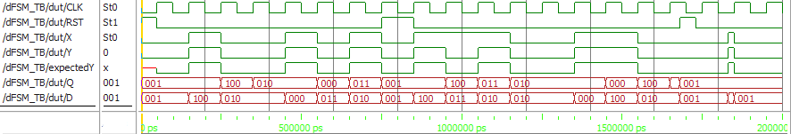
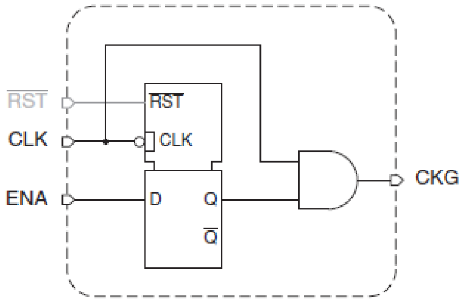
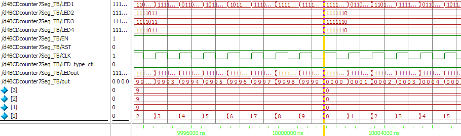

    

 

 
 

<h3 style="text-align: center; ">Ψηφιακά Συστήματα H/W σε Χαμηλά Επίπεδα Λογικής ΙΙ</h3>
<h4 style="text-align: center; margin-top: -20px;">Εργασία 2021</h4>

Κωνσταντίνος Χατζής

ΑΕΜ: 9256

kachatzis@ece.auth.gr

Ημερομηνία: 8/7/2021

<h5>Περιεχόμενα</h5>

[TOC]
 

​	Το σύνολο των αρχείων που χρησιμοποιήθηκαν για τη συγγραφή της παρούσας αναφοράς, καθώς και ο κώδικας σε Verilog και Matlab μπορεί να βρεθεί στο σύνδεσμο: https://github.com/kostascc/HW2-Project 

 

### 0. Εισαγωγή

​	

# I. Finite State Machine

## 1. Ανάλυση

<table style="width:100%;">
<tr>
<td style="border: none;">
<figure style="text-align:center;">
  
  <figcaption>Εικόνα I.5: Ο Γράφος του FSM.</figcaption>
</figure>
</td>
</table>

Πίνακας κωδικοποίησης καταστάσεων

| Κατάσταση | D2   | D1   | D0   |
| --------- | ---- | ---- | ---- |
| A         | 0    | 0    | 1    |
| B         | 1    | 0    | 0    |
| C         | 0    | 1    | 0    |
| D         | 0    | 1    | 1    |
| E         | 0    | 0    | 0    |

Πίνακας Αληθείας

|  >   |  PS  |  <   | Input |  >   |  NS  |  <   | Output |
| :--: | :--: | :--: | :---: | :--: | :--: | :--: | :----: |
|  D2  |  D1  |  D0  |   X   | D2'  | D1'  | D0'  |   Y    |
|  0   |  0   |  0   |   0   |  0   |  1   |  1   |   0    |
|  0   |  0   |  0   |   1   |  1   |  0   |  0   |   1    |
|  0   |  0   |  1   |   0   |  0   |  0   |  1   |   0    |
|  0   |  0   |  1   |   1   |  1   |  0   |  0   |   1    |
|  0   |  1   |  0   |   0   |  0   |  1   |  0   |   0    |
|  0   |  1   |  0   |   1   |  0   |  0   |  0   |   1    |
|  0   |  1   |  1   |   0   |  0   |  0   |  1   |   0    |
|  0   |  1   |  1   |   1   |  0   |  1   |  0   |   1    |
|  1   |  0   |  0   |   0   |  0   |  1   |  0   |   0    |
|  1   |  0   |  0   |   1   |  0   |  1   |  1   |   0    |

<table style="width:100%;">
<tr>
<td style="border: none;">
<figure style="text-align:center;">
  
  <figcaption>Εικόνα I.1: Πίνακας karnaugh D0'.</figcaption>
</figure>
</td>
<td style="border: none;">
<figure style="text-align:center;">
  
  <figcaption>Εικόνα I.2: Πίνακας karnaugh D1'.</figcaption>
</figure>
</td>
</table>

<table style="width:100%;">
<tr>
<td style="border: none;">
<figure style="text-align:center;">
  
  <figcaption>Εικόνα I.3: Πίνακας karnaugh D2'.</figcaption>
</figure>
</td>
<td style="border: none;">
<figure style="text-align:center;">
  
  <figcaption>Εικόνα I.4: Πίνακας karnaugh Y.</figcaption>
</figure>
</td>
</table>

$$
\begin{align}
D_0' &= \bar X \bar D_1 \bar D_2 + \bar X D_0 \bar D_2+X \bar D_0 \bar D_1 D_2 \\
D_1' &= \bar X \bar D_0 \bar D_2 + \bar D_0 \bar D_1 D_2 + X D_0 D_1 \bar D_2 \\
D_2' &= \bar D_1 \bar D_2 X \\
Y &= \bar D_2 X
\end{align}
$$

## 2. Υλοποίηση με συμπεριφορική Verilog

<table style="width:100%;">
<tr>
<td style="border: none;">
<figure style="text-align:center;">
  
  <figcaption>Εικόνα I.5: Behavioural FSM Testbench - Σύγχρονες είσοδοι.</figcaption>
</figure>
</td>
</table>
<table style="width:100%;">
<tr>
<td style="border: none;">
<figure style="text-align:center;">
  
  <figcaption>Εικόνα I.6: Behavioural FSM Testbench. - Ασύγχρονες είσοδοι.</figcaption>
</figure>
</td>
</table>

##3. Υλοποίηση με D-FlipFlop

<table style="width:100%;">
<tr>
<td style="border: none;">
<figure style="text-align:center;">
  
  <figcaption>Εικόνα I.5: D-FF Testbench.</figcaption>
</figure>
</td>
</table>

<table style="width:100%;">
<tr>
<td style="border: none;">
<figure style="text-align:center;">
  
  <figcaption>Εικόνα I.5: Testbench του FSM με D-FF.</figcaption>
</figure>
</td>
</table>

##4. Υλοποίηση με JK-FlipFlop

<table style="width:100%;">
<tr>
<td style="border: none;">
<figure style="text-align:center;">
  
  <figcaption>Εικόνα I.5: JK-FF Testbench.</figcaption>
</figure>
</td>
</table>

<table style="width:100%;">
<tr>
<td style="border: none;">
<figure style="text-align:center;">
  
  <figcaption>Εικόνα I.5: Testbench του FSM με JK-FF.</figcaption>
</figure>
</td>
</table>

# II. Απαριθμητής BCD

## 1. Απαριθμητής με T-FlipFlop

<table style="width:100%;">
<tr>
<td style="border: none;">
<figure style="text-align:center;">
  
  <figcaption>Εικόνα II.0: Κύκλωμα BCD απαριθμητή με T-FF.</figcaption>
</figure>
</td>
</table>

<table style="width:100%;">
<tr>
<td style="border: none;">
<figure style="text-align:center;">
  
  <figcaption>Εικόνα II.0: T-FF Testbench.</figcaption>
</figure>
</td>
</table>

<table style="width:100%;">
<tr>
<td style="border: none;">
<figure style="text-align:center;">
  
  <figcaption>Εικόνα II.0: Testbench απαριθμητή τεσσάρρων bit.</figcaption>
</figure>
</td>
</table>

##2. Κωδιικοποίηση 7-Segment

<table style="width:100%;">
<tr>
<td style="border: none;">
<figure style="text-align:center;">
  
  <figcaption>Εικόνα II.0: 7-Segment LED.</figcaption>
</figure>
</td>
</table>

<table style="width:100%;">
<tr>
<td style="border: none;">
<figure style="text-align:center;">
  
  <figcaption>Εικόνα II.0: Πίνακας αληθείας 7-Segment κωδικοποίησης.</figcaption>
</figure>
</td>
</table>

$$
\begin{align}
a &= A+C+BD+\bar B \bar D \\
b &= \bar B + \bar C \bar D + CD \\
c &= B + \bar C + D \\
d &= \bar B \bar D + C \bar D + B \bar C D + \bar B C + A \\
e &= \bar B \bar D + C \bar D \\ 
f &= A + \bar C \bar D + B \bar C + B \bar D \\
g &= A + B \bar C + \bar B C + C \bar D\\
\end{align}
$$

<table style="width:100%;">
<tr>
<td style="border: none;">
<figure style="text-align:center;">
  
  <figcaption>Εικόνα II.0: Testbench κωδικοποιητή BCD σε 7-Segment LED κοινής καθόδου.</figcaption>
</figure>
</td>
</table>

<table style="width:100%;">
<tr>
<td style="border: none;">
<figure style="text-align:center;">
  
  <figcaption>Εικόνα II.0: Testbench κωδικοποιητή BCD σε 7-Segment LED κοινής ανόδου.</figcaption>
</figure>
</td>
</table>

## 3. Απαριθμητής τεσσάρων ψηφίων

<table style="width:100%;">
<tr>
<td style="border: none;">
<figure style="text-align:center;">
  
  <figcaption>Εικόνα II.0: Testbench απαριθμητή τεσσάρων ψηφίων - Έναρξη κυκλώματος.</figcaption>
</figure>
</td>
</table>

<table style="width:100%;">
<tr>
<td style="border: none;">
<figure style="text-align:center;">
  
  <figcaption>Εικόνα II.0: Testbench απαριθμητή τεσσάρων ψηφίων - Αλλαγή δεκάδας.</figcaption>
</figure>
</td>
</table>

## 4. Απεικόνιση απαριθμητή τεσσάρων ψηφίων σε 7-Segment LEDs

<table style="width:100%;">
<tr>
<td style="border: none;">
<figure style="text-align:center;">
  
  <figcaption>Εικόνα II.0: Κύκλωμα Gated Clock.</figcaption>
</figure>
</td>
</table>

<table style="width:100%;">
<tr>
<td style="border: none;">
<figure style="text-align:center;">
  
  <figcaption>Εικόνα II.0: D-FF Testbench.</figcaption>
</figure>
</td>
</table>

<table style="width:100%;">
<tr>
<td style="border: none;">
<figure style="text-align:center;">
  
  <figcaption>Εικόνα II.0: Testbench απεικόνισης απαριθμητή τεσσάρων ψηφίων σε 7-Segment LED κοινής καθόδου.</figcaption>
</figure>
</td>
</table>

<table style="width:100%;">
<tr>
<td style="border: none;">
<figure style="text-align:center;">
  
  <figcaption>Εικόνα II.0: Testbench απεικόνισης απαριθμητή τεσσάρων ψηφίων σε 7-Segment LED κοινής ανόδου.</figcaption>
</figure>
</td>
</table>

<table style="width:100%;">
<tr>
<td style="border: none;">
<figure style="text-align:center;">
  
  <figcaption>Εικόνα II.0: Testbench απεικόνισης απαριθμητή τεσσάρων ψηφίων σε 7-Segment LED κοινής καθόδου - Αλλαγή δεκάδας.</figcaption>
</figure>
</td>
</table>

# III. Απο/κωδικοποίηση Hamming

## 1. Ανάλυση

<table style="width:100%;">
<tr>
<td style="border: none;">
<figure style="text-align:center;">
  
  <figcaption>Εικόνα II.0: Πίνακας κωδικοποίησης Hamming (12,5) - Θέσεις των Parity Bits.</figcaption>
</figure>
</td>
</table>

$$
\begin{align}
P_1 &= D_1 \oplus D_3 \oplus D_5 \oplus D_7 \oplus D_9 \oplus D_{11} \oplus D_{13} \oplus D_{15} \oplus D_{17} \\
P_2 &= D_2 \oplus D_3 \oplus D_6 \oplus D_7 \oplus D_{10}  \oplus D_{11}  \oplus D_{14} \oplus D_{15} \\
P_3 &= D_4 \oplus D_5 \oplus D_6 \oplus D_7  \oplus D_{12} \oplus D_{13} \oplus D_{14} \oplus D_{15} \\
P_4 &= D_8 \oplus D_9 \oplus D_{10} \oplus D_{11} \oplus D_{12} \oplus D_{13} \oplus D_{14} \oplus D_{15} \\
P_5 &= D_{16} \oplus D_{17}
\end{align}
$$

$$
\left[ P_5 P_4 P_3 P_2 P_1\right]
$$

## 2. Κωδικοποιητής

<table style="width:100%;">
<tr>
<td style="border: none;">
<figure style="text-align:center;">
  
  <figcaption>Εικόνα II.0: Testbench κωδικοποιητή - Δυαδική απεικόνιση.</figcaption>
</figure>
</td>
</table>

<table style="width:100%;">
<tr>
<td style="border: none;">
<figure style="text-align:center;">
  
  <figcaption>Εικόνα II.0: Testbench κωδικοποιητή - Δεκαδική απεικόνιση (Α' μέρος).</figcaption>
</figure>
</td>
</table>

<table style="width:100%;">
<tr>
<td style="border: none;">
<figure style="text-align:center;">
  
  <figcaption>Εικόνα II.0: Testbench κωδικοποιητή - Δεκαδική απεικόνιση (Β' μέρος).</figcaption>
</figure>
</td>
</table>

## 3. Αποκωδικοποιητής

<table style="width:100%;">
<tr>
<td style="border: none;">
<figure style="text-align:center;">
  
  <figcaption>Εικόνα II.0: Testbench αποκωδικοποιητή (Α' μέρος).</figcaption>
</figure>
</td>
</table>

<table style="width:100%;">
<tr>
<td style="border: none;">
<figure style="text-align:center;">
  
  <figcaption>Εικόνα II.0: Testbench αποκωδικοποιητή (Β' μέρος).</figcaption>
</figure>
</td>
</table>

##4. Απο/κωδικοποίηση σε κανάλι θορύβου

<table style="width:100%;">
<tr>
<td style="border: none;">
<figure style="text-align:center;">
  
  <figcaption>Εικόνα II.0: Testbench Απο/κωδικοποίησης σε κανάλι θορύβου - Δυαδική απεικόνιση.</figcaption>
</figure>
</td>
</table>

<table style="width:100%;">
<tr>
<td style="border: none;">
<figure style="text-align:center;">
  
  <figcaption>Εικόνα II.0: Testbench Απο/κωδικοποίησης σε κανάλι θορύβου - Δεκαδική απεικόνιση.</figcaption>
</figure>
</td>
</table>

# IV. Παράρτημα

## Βιβλιογραφία

ECE/Comp Sci 352 Digital Systems Fundamentals, Charles R. Kime, University of Wisconsin - Madison, 2001 Prentice Hall

